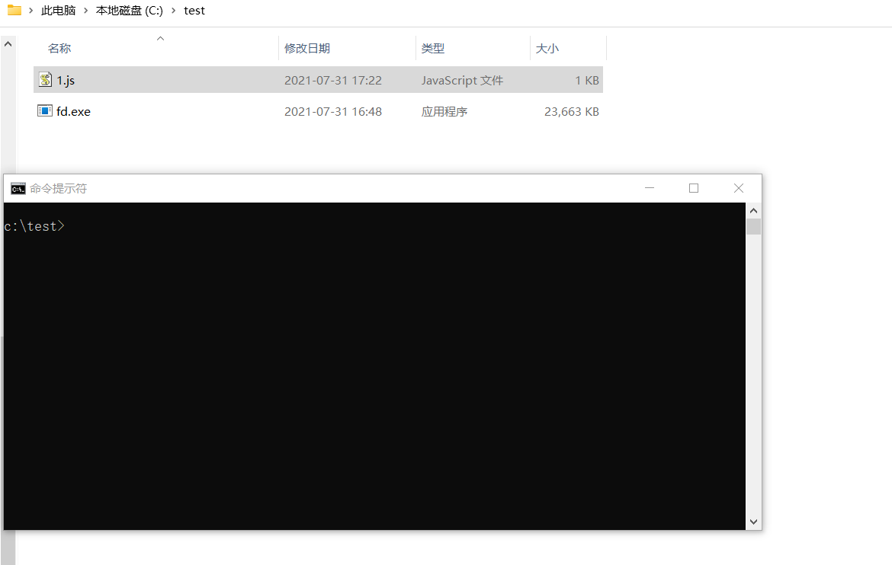

#### api(导出api) 使用方法:
````
api 1.js -devi string -name string
````

#### -path
- string api监听路径

#### -jsbyte
- bool 是否使用编译过的js

#### -http
- bool 是否使用http，默认位true

#### -address:
- 监听地址 默认为 ":8080"

#### -name
- ios is app icon label
- android is app icon label
- fd lsapp 获取
- 如果获取不到,fd lsps 获取

#### -devi:
- default: usb
- -devi usb(usb devi)
- -devi u(usb devi)
- -devi local(local devi)
- -devi localhost(local devi)
- -devi ip:port(remote device)
- -devi 1234(devi id)

```
fd api api.js -name 通讯录 -address :8080


POST /call HTTP/1.1
Host: localhost:8080
User-Agent: Charles/4.6.1
Content-Type: text/json
Content-Length: 63

{
    "func":"add",
    "args":[1,2],
    "timeout":"30s"
}
ret:
{
	"code": 0,
	"msg": "操作成功",
	"data": 3
}
```